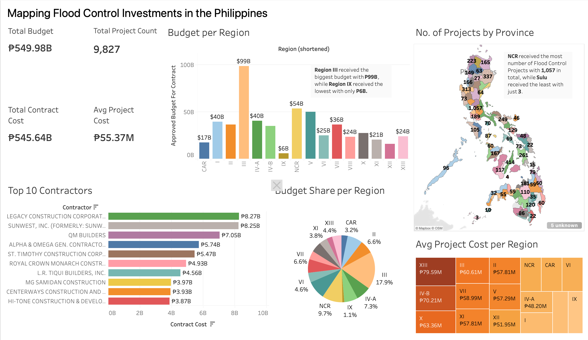

# Protecting Communities: An Analysis of Philippine Flood Control Investments (2018–2025)

## Overview
Flooding remains one of the most frequent and costly natural hazards in the Philippines, affecting millions of people each year through damaged homes, disrupted livelihoods, transportation delays, and risks to public safety.

To address these challenges, the Philippine government, through the Department of Public Works and Highways (DPWH), invests billions of pesos annually in flood control infrastructure projects. These projects are intended to reduce flood risks, protect communities, and improve disaster resilience across the country.

At the same time, flood control spending has often been the subject of public discussion and scrutiny. Citizens, researchers, and policymakers have raised questions about where projects are being implemented, how funds are distributed, and whether investments align with areas most vulnerable to flooding.

This project does not seek to evaluate political decisions or make conclusions about individual projects. Instead, it uses publicly available data to explore patterns in flood control investments and promote greater transparency through data visualization.

By transforming project records into an interactive dashboard, this analysis aims to help citizens better understand how public resources are allocated and encourage data-informed conversations about infrastructure, resilience, and community development.

---
## Why This Project Matters

Flooding affects millions of Filipinos every year and often becomes a topic of public discussion, especially during typhoon season.

While flood control projects receive substantial government funding, project information is typically scattered across large datasets that are difficult for the public to interpret.

This project helps answer questions such as:

* Where are flood control investments concentrated?
* Which regions receive the largest share of funding?
* Which provinces have the most projects?
* Are projects evenly distributed across the country?
* Which contractors receive the largest contracts?

By visualizing the data, citizens can better understand how public infrastructure investments are allocated nationwide.

---
## Dataset

Source: Kaggle ([DPWH Flood Control Projects](https://www.kaggle.com/datasets/bwandowando/dpwh-flood-control-projects))

### Dataset Summary
| Metric | Value |
|---------|---------|
| Total Projects | 9,827 |
| Total Budget | ₱549.98 Billion |
| Total Contract Cost | ₱545.64 Billion |
| Average Project Cost | ₱55.37 Million |
| Regions Covered | All Philippine Regions |

### Key Fields
* Region
* Province
* Municipality
* Project Name
* Project Type
* Approved Budget for Contract
* Contract Cost
* Contractor
* Start Date
* Actual Completion Date
* Geographic Coordinates

---
## Data Cleaning Process
Data preparation was performed in Python using Pandas.

### Cleaning Steps:
* Inspected dataset structure and data types
* Validated missing values
* Converted funding columns to numeric format
* Converted project dates into datetime format
* Reviewed duplicate records
* Created a cleaned dataset for visualization

### Data Quality Findings: 
* The dataset contains 22 columns and 9,855 records.
* Missing values were primarily found in the Municipality field.
* No duplicate records were identified.
* A small number of funding records could not be converted to numeric format and were retained as missing values to preserve data integrity.

---
## Dashboard Preview

View in [Tableau Public](https://public.tableau.com/app/profile/nicanor.jr.peril/viz/FloodControlProjectsinthePhilippines/Dashboard2?publish=yes)

---
## Dashboard Overview
The Tableau dashboard provides a nationwide view of flood control investments.

### Dashboard Components

**KPI Summary**
* Total Budget
* Total Contract Cost
* Total Project Count
* Average Project Cost

**Budget per Region**
Compares approved budgets across Philippine regions.

Key Finding:
* Region III received the largest allocation at approximately ₱99B.
* Region IX received the smallest allocation at approximately ₱6B.

**Number of Projects by Province**
Interactive map showing project concentration across the country.

Key Finding:
* NCR recorded the highest number of projects (1,057).
* Sulu recorded the fewest projects (3).

**Top 10 Contractors**
Ranks contractors by total contract value.

Key Finding:
* Legacy Construction Corporation received the highest total contract value at approximately ₱8.27B.

**Budget Share per Region**
Displays each region’s percentage share of total approved funding.

**Average Project Cost per Region**
Treemap highlighting regional differences in average project costs.

Key Finding:
* Region XIII recorded the highest average project cost at approximately ₱79.59M per project.

---
## Tools Used

Data Preparation
* Python
* Pandas
* Jupyter Notebook

Visualization
* Tableau Public

Version Control
* Git
* GitHub

---
## Repository Structure
```
flood-control-projects-ph/
│
├── data/
│   ├── dpwh_flood_control_projects_raw.csv
│   └── dpwh_flood_control_projects_clean.csv
│
├── notebooks/
│   └── data_cleaning.ipynb
│
├── tableau/
│   └── Flood_Control_Projects_Ph.twbx
│
├── images/
│   └── Flood_Control_Projects_Ph_preview.png
│
└── README.md
```

---
## Key Insights
* Nearly ₱550 billion has been allocated to flood control projects nationwide.
* Funding distribution varies significantly across regions.
* NCR contains the highest concentration of projects.
* A relatively small group of contractors accounts for several billion pesos in awarded contracts.
* Average project costs differ considerably between regions, indicating differences in project scale and scope.